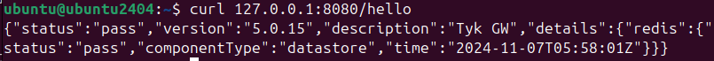

# Installation de Tyk-Gateway sur le port 8080

**Commande pour lancer Tyk Gateway avec docker:**
```bash
docker run -it -d --name -p 8080:8080 tyk-gateway evrad7/ms2d5-tyk
```

**Vérification du succès de l’installation :**
```bash
  curl localhost:8080/hello
```
Le résultat devrait être similaire à cette image

